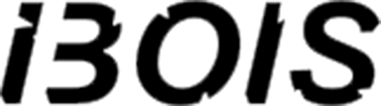
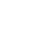
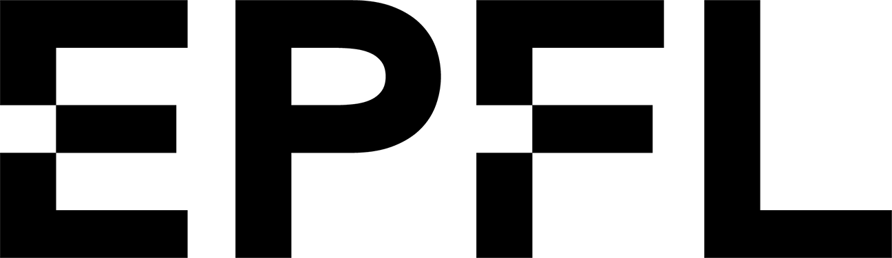

<h1 align="center">augmented-stacking</h1>

<div align = "center">
    <a href = "https://github.com/ibois-epfl/augmented-stacking">
        
    </a>
    <a href = "https://github.com/ibois-epfl/augmented-stacking">
        
    </a>
    <a href = "https://github.com/ibois-epfl/augmented-stacking">
        
    </a>
    <a href = "https://github.com/ibois-epfl/augmented-stacking">
        
    </a>
</div>
<br/>


<p align="center">
    
</p>
<br/>

<div align = "center">
    <a>
        
    </a>
    <a>
        
    </a>
    <a>
        
    </a>
    <a>
        
    </a>
    <a>
        
    </a>
</div>

<br />

Development code for an `dry-stone` and `-timber` stacking technique in AR. `Augmented Stacking` is a `CLI` software developed and tested on `Ubuntu 20.04 LTS`.

Augmented Stacking is an augmented system designed to guide unexperienced users through the stacking of complex and irregular geometries. This digital fabrication system was applied to the assembly of one layer of half-timber dry-stone wall. Augmented Stacking is composed of two components: the stacking algorithm (which calculates the pose for each stone or irregular object feeded to the system) and the augmented pipeline to display the information. 

For more info contact [andrea.settimi@epfl.ch](andrea.settimi@epfl.ch).

<p>
    
</p>

<p>
    
</p>

## To run the code

**[00]** The software is made to be used with any type of LED projector. Nevertheless you will need a camera [ZED2i](https://www.stereolabs.com/zed-2i/) to work with the current version. The code can be easily adapted to any type of 3D sensor. 

**[0]** The address of your digitized library of digital-twins to assemble need to be replaced in `dataset_IO.py`, our dataset is [here](https://github.com/ibois-epfl/augmented-stacking-dataset):

https://github.com/ibois-epfl/augmented-stacking/blob/ad33e2c7a78ad0c0e8843e94f3ad093bb4c10f47/dataset_IO.py#L28-L72

**[1]** Install the ZED2i [SDK](https://download.stereolabs.com/zedsdk/3.7/cu115/ubuntu20)

**[2]** Run the virtual environment with `fish`:
```bash
source ./venv/bin/activate
```

**[3]** Run a calibration and follow the instraction in the console:
```bash
python ./calib/calib.py
```

**[4]** Run augmented stacking:
```bash
python ./calib/calib.py
```

## Credits
```
*   IBOIS, the Laboratory for Timber Construction

        Andrea Settimi (PhD researcher, conceptualization, software&hardware development, AR interface design)
	David Rebiffe (intern, software development)
	Julien Gamerro (Post-Doc, conceptualization, supervision)
	Yves Weinand (Lab head, supervision)


*   EESD, the group Earthquake Engineering and Structural Dynamics

	Qianqing Wang (PhD researcher, stacking algorithm)
	Katrin Beyer (Lab head, supervision)


*   Image HUB, the support group for imaging analysis

	Edwardo Ando (technicien, hardware development, image analysis)


Augmented Stacking was funded by the Cluster ENAC initiative 2021-2022.
```


